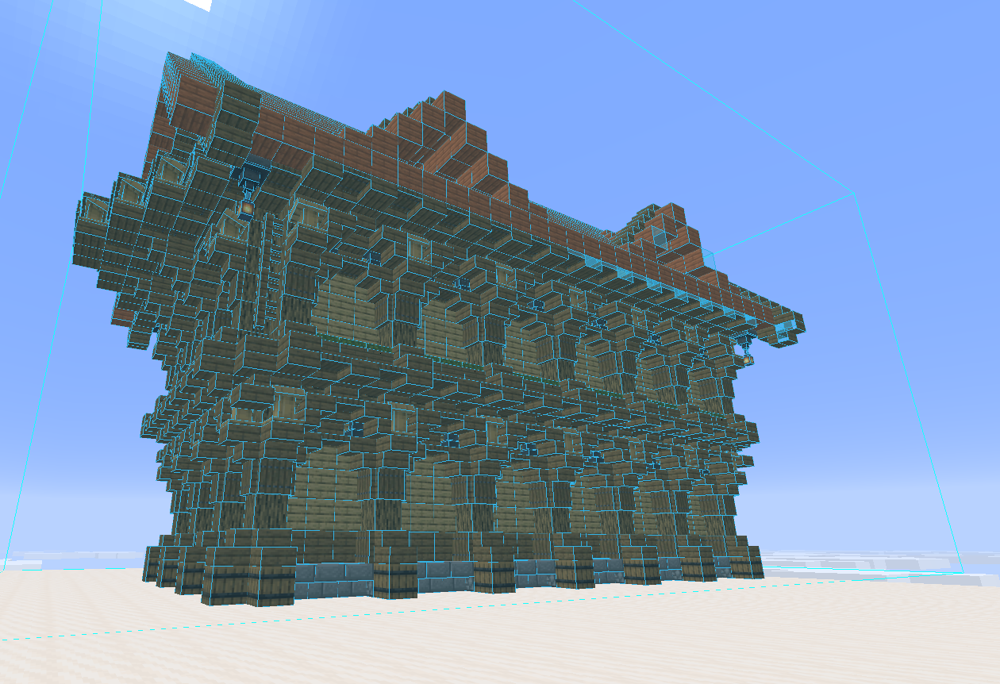
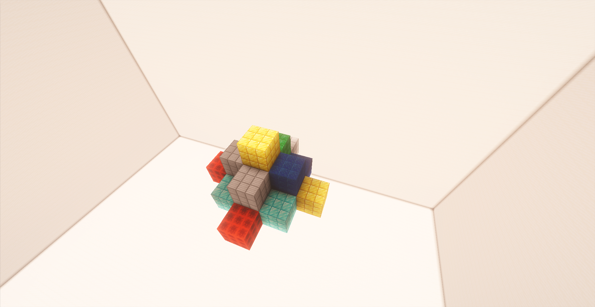

# Litematica自動建築/ haruta0918


成果発表用プレゼンテーション
--

## 作ったもの
Litematicaという建築系MODから.litematicファイルを読み込み
自動で建築するAPIを作る
--

## Litematicaについて

---

### このAPIの必要性
（なぜ必要なのか）
  
  自動建築する方法はほかにもある
　　　　　　　　　　　

(WorldEditを使用する、クリエイティブ、fill…)

→・元の建築物がなければwolrdEditを使えない
・手間がかかりすぎる

(もっと初心者でも使いやすい方法がほしい)
 


--


### automatic architectureのカスタマイズポイント
・サイズの変更
・座標変更
・ファイルの切り替え

---

### Litematica自動建築の詳しい仕組みの説明
①pygamedisplayを開き、座標などを指定する
```python
screen = pygame.display.set_mode([700, 800])
pygame.display.set_caption("Oキーでファイル選択")
mouse_x, mouse_y = pygame.mouse.get_pos()
screen.fill((100, 100, 255))
```

②指定された情報をもとに、座標やファイルを読み込む
```python
X0, Y0, Z0 = mazix, maziy + 63, maziz
```
```python
                    schem = Schematic.load(schem_path)
                    reg = list(schem.regions.values())[0]
```
--

③建築
```python
if mouse_x > 100 and mouse_x < 500 and mouse_y > 480 and mouse_y < 580:
  if schem_path:
      X0, Y0, Z0 = mazix, maziy + 63, maziz
      sleep(2)
      schem = Schematic.load(schem_path)
      reg = list(schem.regions.values())[0]
      size = scale
      X1, Y1, Z1 = 0, 0, 0
      X2, Y2, Z2 = 0, 0, 0
      for z in reg.zrange():
        X1, Y1, Z1 = 0, 0, 0
        Z2 += size
        ・・・
```
--

④完成!!


---

### 使い方
①Oキーを押してファイルを選択

②座標を変更

③サイズの変更

④Makeボタンを押す

---

### Thanks for listening!! 

---

### 実際の動画
<video controls src="images/Video Project 2.mp4" title="Title"></video>
---