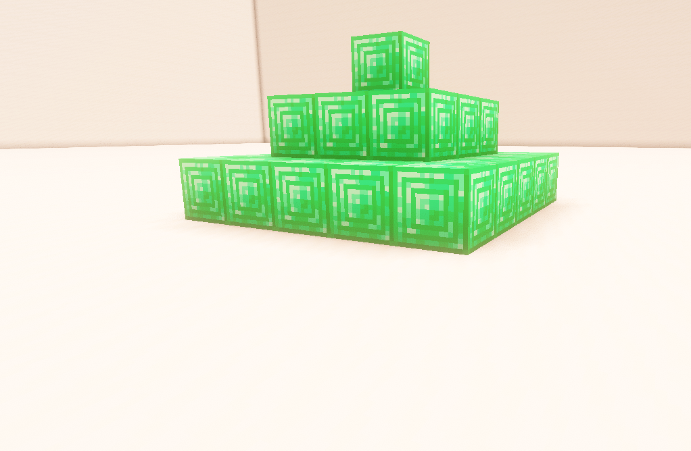

# Minecraft ピラミッド自動建築

9期生 4番　梅田　智

---

## 1. どんなプログラム？

このプログラムは、

**Minecraft上に素材を変えてピラミッドを自動で建築するプログラム**

です。

pygameで操作画面を作り、  
選択したブロックをMinecraftに送信して建築します。

---

## 2. このプログラムでできること

- 建築に使うブロックを選択
- 選択したブロックをMinecraftへ送信
- ピラミッドを自動で建築
- pygameで操作画面を表示


---

### 対応しているブロック
- 石レンガ
- ガラス
- シーランタン
- クォーツブロック
- 銅ブロック
- 鉄ブロック
- 金ブロック
- ダイヤモンドブロック
- ネザライトブロック
- エメラルドブロック

---

## 3. プログラムの構成

```text
pygame
   ↓
ブロックを選択
   ↓
建築ボタンをクリック
   ↓
座標を計算
   ↓
mc_remote
   ↓
Minecraftにブロックを設置
```

---

## 4. ブロックを選択

画面にブロックの一覧を表示し、  
クリックしたブロックを建築に使用します。

```python
BLOCK_OPTIONS = [
    ("石レンガ", block.STONE_BRICKS),
    ("ガラス", block.GLASS),
    ("シーランタン", block.SEA_LANTERN),
    ("クォーツブロック", block.QUARTZ_BLOCK),
    ...
]
```

選択された番号を

```python
selected_block_index
```

に保存しています。

---

## 5. 選択したブロックを取得

建築するときに、  
選択されたブロックを取り出します。

```python
BLOCK = BLOCK_OPTIONS[selected_block_index][1]
```

これによって、

「石レンガを選んだら石レンガ」

「ダイヤモンドブロックを選んだらダイヤモンドブロック」

というように変更できます。

---

## 6. ピラミッドの作り方

ピラミッドは、

**下の段を大きくして、上に行くほど小さくする**

ことで作っています。

```python
size = 5
size2 = 0

for i in range(size):
    ...
    Y += 1
    size -= 2
    size2 += 1
```

最初は5×5、

次は3×3、

最後は1×1

というように変化します。

---

## 7. 座標を計算

Minecraftでは、

```text
X = 横方向
Y = 高さ
Z = 奥行き
```

として座標を指定します。

例えば、

```python
mc.setBlock(X, Y, Z, BLOCK)
```

とすることで、

指定した座標にブロックを設置できます。

---

## 8. ピラミッドのイメージ

```text
      ■
     ■■■
    ■■■■■
   ■■■■■■■
  ■■■■■■■■■
```

下の段ほど大きく、

上の段ほど小さくなるように

X・Y・Zの値を変更しています。

---

## 9. Minecraftへの設置

実際にブロックを置いている部分です。

```python
for i in range(size):
    Z = size2

    for i in range(size):
        mc.setBlock(X, Y, Z, BLOCK)
        Z += 1

    X += 1
```

二重のループを使って、

**1つずつブロックを設置しています。**

---

## 10. pygameによる操作画面

pygameを使って、

- ブロック選択画面
- 選択状態
- 建築ボタン

などを表示しています。

```python
screen = pygame.display.set_mode([500, 600])

pygame.display.set_caption("ピラミッド")
```

Minecraftを直接操作するのではなく、

**専用の操作画面から建築できる**

ようにしました。

---

## 11. 実際の動作

### ① ブロックを選択

↓  

### ② 建築ボタンをクリック

↓  

### ③ プログラムが座標を計算

↓  

### ④ Minecraftにブロックを送信

↓  

### ⑤ ピラミッドが完成！

---

## 12. 工夫したところ

### ブロックを自由に変更できる

同じプログラムでも、

石レンガやダイヤモンドなど、

好きなブロックでピラミッドを作れます。

また、座標を1つずつ指定するのではなく、

**for文を使って自動的に座標を計算**

するようにしました。

---

## 13. 難しかったところ

特に難しかったのは、

**ピラミッドの形になるように座標を計算すること**

です。

サイズを

```text
5 → 3 → 1
```

と小さくしながら、

同時にXとZの開始位置も変更する必要がありました。

---

## 14. 完成したもの



---

## 15. まとめ

今回のプログラムでは、

- pygameで操作画面を作る
- ブロックを選択できるようにする
- 座標を計算する
- mc_remoteを使ってMinecraftを操作する

ということを行いました。

**プログラムからMinecraftを自動操作できることが、この作品のポイントです。**

---

## ご清聴ありがとうございました